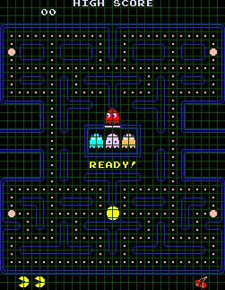
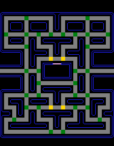
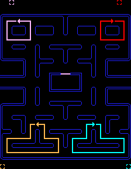
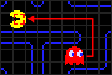
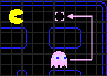
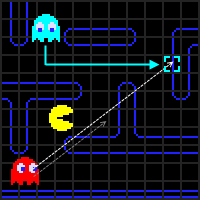
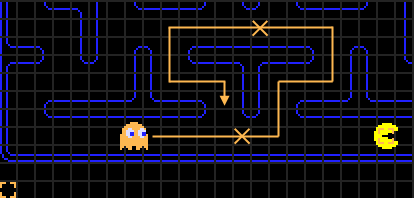

# PACMAN
## link utili
- https://gameinternals.com/understanding-pac-man-ghost-behavior
- https://www.youtube.com/watch?v=dScq4P5gn4A
------------------
## basic settings

- 28 x 36 tiles_classes (original: 8x8 pixel, resolution 224x288)
- three lives
- 4 energizers
- 240 dots
- piece of fruit after 70 dots
- piece of fruit after 170 more dots
- tunnels connect left to right

## scoring
- dot: 10 points
- energizer: 50 points
- ghost: 200, 400, 800, 1600 points
- cherry: 100 points, strawberry: 300 points, orange: 500 points, apple: 700 points, banana: 1000 points

## characters
- pacman
- shadow - "blinky" - red
- speedy - "pinky" - pink
- bahsful - "inky" - cyan
- pokey - "clyde" - orange
-------

## basic game settings
- blinky exits the ghost house fist
- ghosts go back to the house if eaten
- ghost house is inaccessible
- when ghosts leave the house they move left
- ghosts do not invert direction

## ghost states
switched with a timer (paused when on frightened mode, restarted in the house)
1. scatter 7s
2. chase 20s
3. scatter 7s
4. chase 20s
5. scatter 5s
6. chase 20s
7. scatter 5s
8. chase permanent
### chase
pacman's position defines taget tile
### scatter
fixed target tile
### frightened
pseudorandomic target tile

------
## ghosts movement

- chose turns on which tile is closer in a straight line (precedence: up, left, down. no right)
- ghosts cannot turn upwards on yellow interceptions (exept on frightened mode)
- when ghosts change state they have to invert direction

## ghosts targets in scatter

## ghosts targets in chase
### blinky

- pacman's tile
- starts with the game
### pinky

- four tiles_classes ahead of pacman (original: overflow error)
- starts after blinky
### inky

- double the vector from blinky to two tiles_classes ahead of pacman
- starts after pacman has eaten 30 dots
### clyde

- farther than eight tiles_classes: blinky's strategy
- closer: scatter mode